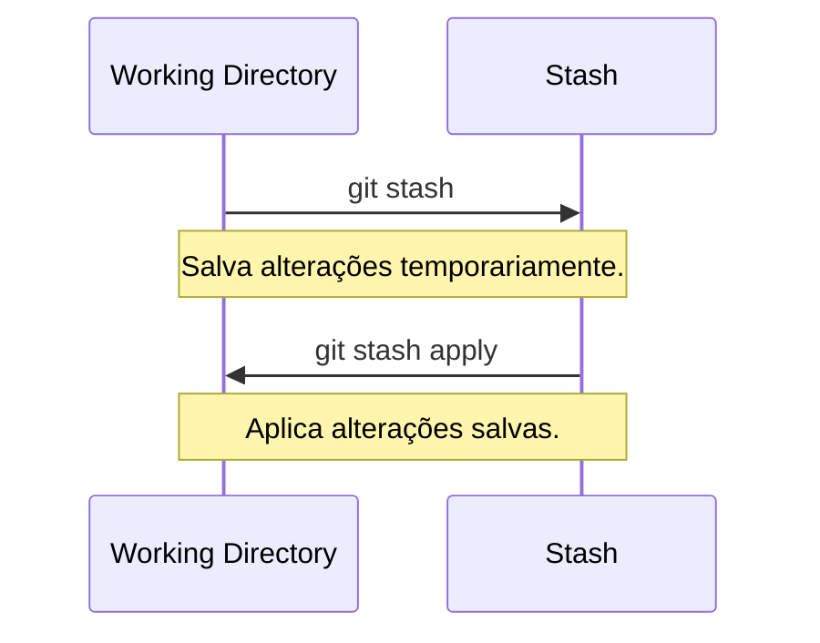
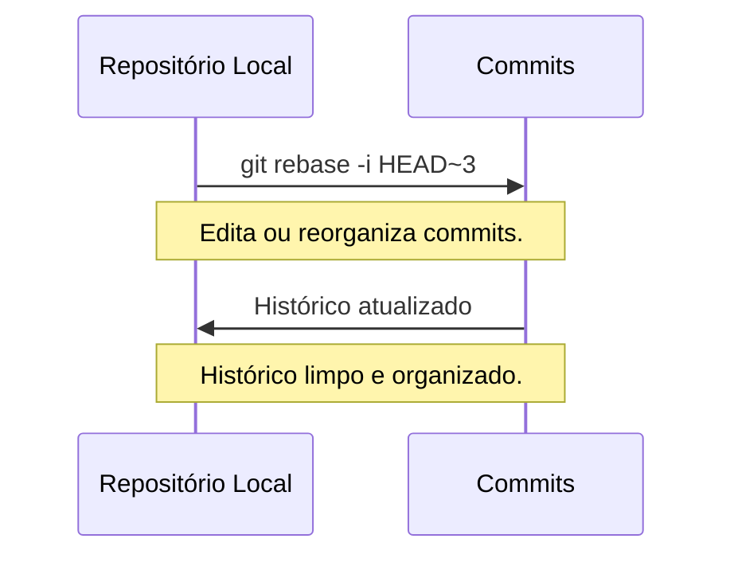

# Comandos Avançados

Além dos comandos básicos, há comandos um pouco mais avançados que podem
melhorar significativamente seu fluxo de trabalho. Dois exemplos importantes
são: `git stash` e `git rebase -i`.

----------

## Stash

O comando `git stash` permite salvar temporariamente alterações que ainda não
estão prontas para commit, sem precisar criar um commit temporário.

### Salvando alterações no stash

Para salvar as alterações atuais:
```bash
git stash
```

### Listando stashes

Para ver a lista de stashes salvos:
```bash
git stash list
```

### Aplicando um stash

Para aplicar as alterações salvas mais recentes:
```bash
git stash apply
```

Para aplicar um stash específico:
```bash
git stash apply stash@{n}
```
(Onde `n` é o índice do stash específico.)

### Removendo um stash

Para remover o stash mais recente após aplicá-lo:
```bash
git stash drop
```

Para remover um stash específico:
```bash
git stash drop stash@{n}
```



----------

## Rebase interativo

O comando `git rebase -i` permite reorganizar, editar ou combinar commits de
forma interativa. É uma ferramenta ótima para limpar o histórico antes de
enviar alterações para o repositório remoto.

### Iniciando um rebase interativo

Para editar os últimos `n` commits:
```bash
git rebase -i HEAD~n
```

### Opções comuns no rebase interativo

- pick: Mantém o commit como está.
- reword: Altera a mensagem do commit.
- edit: Permite alterar o conteúdo do commit.
- squash: Combina o commit com o anterior.
- drop: Remove o commit.

### Exemplo de uso

1. Execute `git rebase -i HEAD~3` para editar os últimos 3 commits.
2. No editor que abrir, altere `pick` para `reword`, `squash` ou outras opções.
3. Salve o arquivo e feche o editor para aplicar as alterações.



----------

[Cap. Anterior](./boas-praticas.md) - [Próx. Capítulo](./problemas.md)
