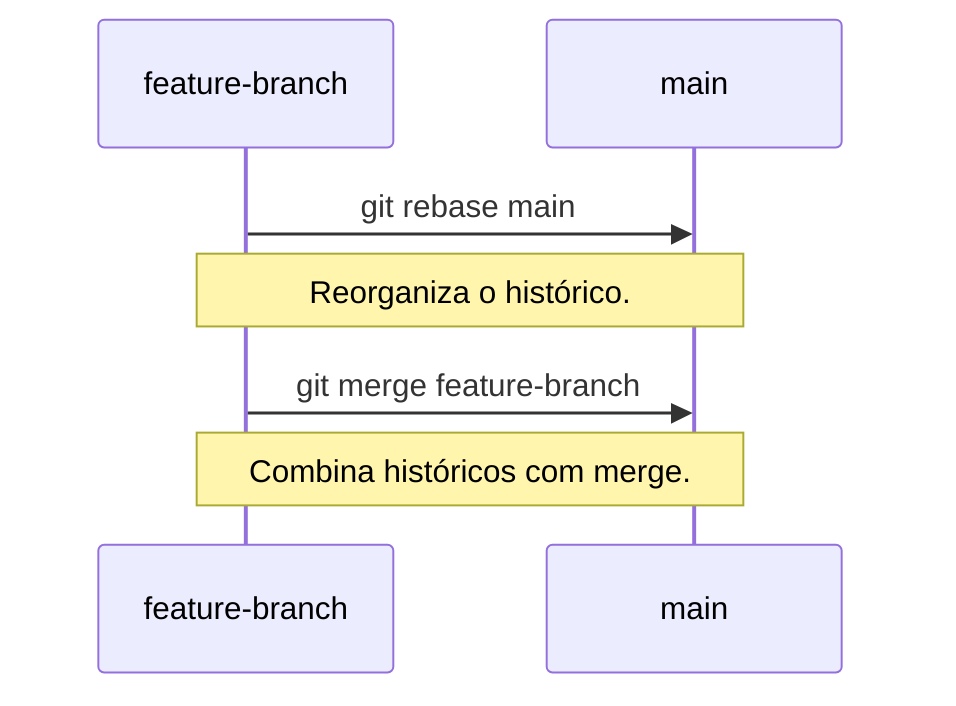

# Boas Práticas e Workflows

É essencial seguir as boas práticas para manter um repositório organizado e
facilitar a colaboração em equipe.

----------

## Mensagens de commit claras

Mensagens de commit bem escritas ajudam a entender o histórico do projeto e o
propósito de cada alteração. Também é importante **fazer commits regulares**,
assim sendo possível reverter mais facilmente mudanças de forma
modular/granular.

### Conventional Commits

Conventional Commits é um padrão para escrever mensagens de commit de forma
consistente. Ele usa uma estrutura simples:

```
<tipo>[escopo opcional]: <descrição>

[corpo opcional]

[rodapé opcional]
```

#### Exemplo:

```bash
feat: adicionada funcionalidade de login

Adiciona a funcionalidade de login com autenticação via OAuth.
Utilizada em foo e bar.

Refs: #123
```

#### Tipos comuns:

- `feat`: Nova funcionalidade.
- `fix`: Correção de bugs.
- `docs`: Alterações na documentação.
- `style`: Formatação ou estilo de código.
- `refactor`: Refatoração de código.
- `chore`: Mudanças rotineiras como bump de versões.

----------

## Workflows

### Git Flow

Git Flow é um workflow que define branches específicos para desenvolvimento, releases e hotfixes.
Basicamente um modelo de branches para manter o repositório consistente.

- `main`: Branch principal com o código estável.
- `develop`: Branch de desenvolvimento.
- `feature/`: Branches para novas funcionalidades.
- `release/`: Branches para preparação de releases.
- `hotfix/`: Branches para correções urgentes.

#### Fluxo básico:

1. Crie uma branch `feature/` para desenvolver uma nova funcionalidade.
2. Merge a `feature/` em `develop` quando estiver pronta.
3. Crie uma branch `release/` para preparar uma nova versão.
4. Merge a `release/` em `main` ao finalizar.

----------

## Rebase vs Merge

### Rebase

O rebase reorganiza o histórico de commits, aplicando as alterações de uma
branch em cima de outra.

#### Quando usar:

- Para manter um histórico linear e limpo.
- Antes de enviar alterações para o repositório remoto.

#### Comando:
```bash
git checkout feature-branch
git rebase main
```

### Merge

O merge combina o histórico de duas branches, criando um novo commit de merge.

#### Quando usar:

- Para integrar branches com históricos divergentes.
- Em workflows como Git Flow, onde branches são mescladas explicitamente.

#### Comando:
```bash
git checkout main
git merge feature-branch
```



[Cap. Anterior](./tags.md) - [Próx. Capítulo](./avancado.md)
