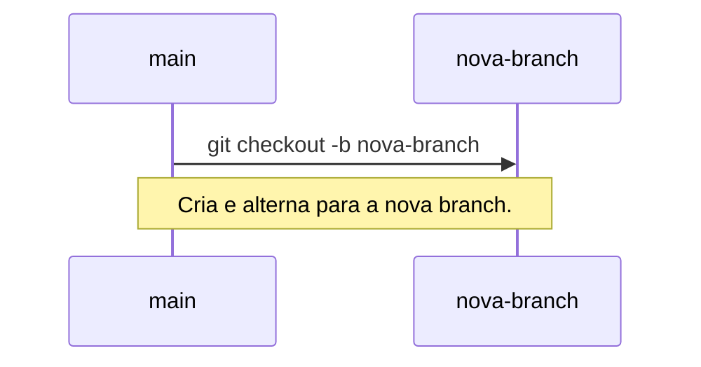
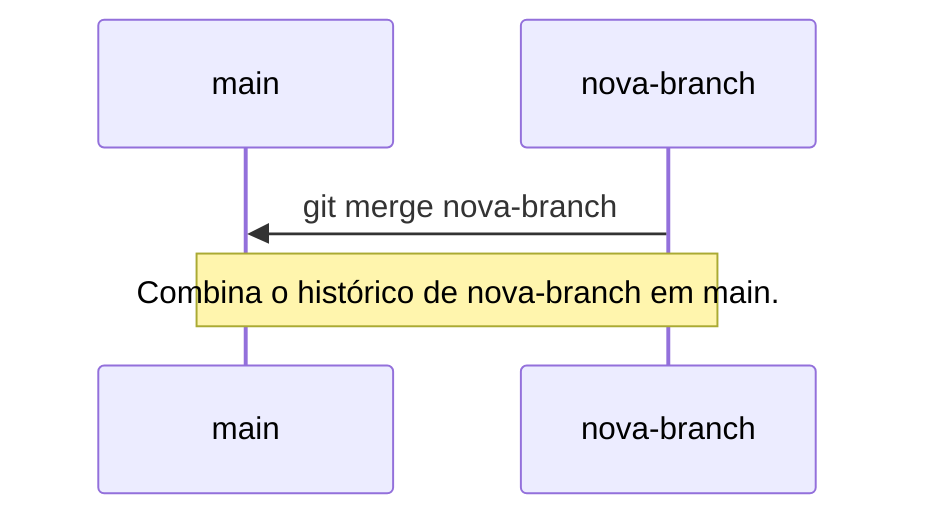
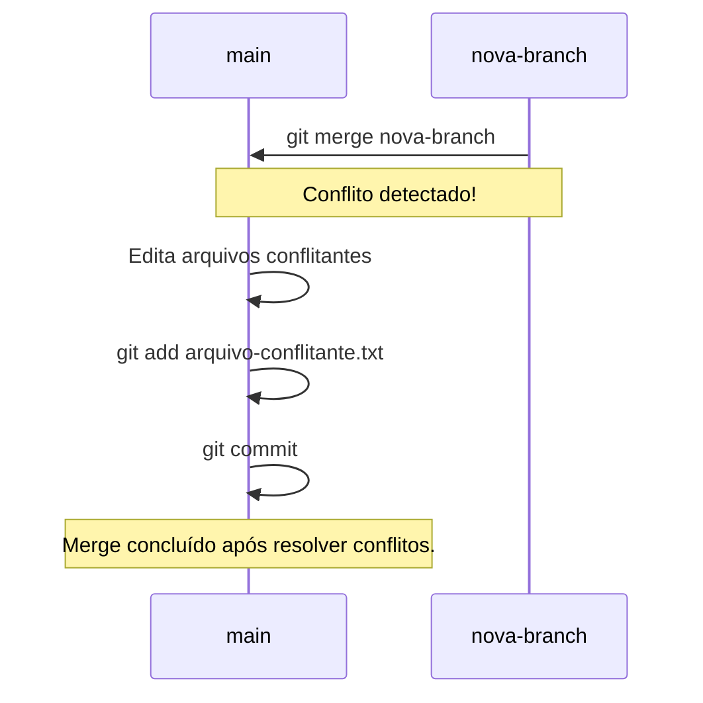

# Trabalhando com Branches

Branches (ramificações) são uma parte essencial do Git, permitindo que você
trabalhe em diferentes versões do seu projeto simultaneamente.

----------

## Criando e trocando de branch

### Criando uma nova branch

Use `git branch` para criar uma nova branch. Isso não altera a branch atual, apenas cria uma nova referência.

```bash
git branch nova-branch
```

### Trocando de branch

Use `git checkout` para alternar para uma branch existente.

```bash
git checkout nova-branch
```

Ou, para criar e trocar para uma nova branch em um único comando:
```bash
git checkout -b nova-branch
```



----------

## Merge de branches

`git merge` é usado para combinar o histórico de duas branches.

### Realizando um merge

1. Estando na branch que receberá as alterações (por exemplo, `main`).
2. Use `git merge` para trazer as alterações de outra branch.

```bash
git checkout main
git merge nova-branch
```



----------

## Resolvendo conflitos

Conflitos ocorrem quando Git não consegue mesclar automaticamente as
alterações de duas branches. Nesses casos, você precisa resolver manualmente
as diferenças.

### Passos para resolver conflitos:

1. Abra os arquivos com conflitos. As áreas conflitantes são marcadas com `<<<<<<<`, `=======` e `>>>>>>>`.
2. Edite os arquivos para resolver as diferenças.
3. Adicione os arquivos resolvidos à staging area:
   ```bash
   git add arquivo-conflitante.txt
   ```
4. Complete o merge:
   ```bash
   git commit
   ```



[Cap. Anterior](./historico.md) - [Próx. Capítulo](./remotos.md)
