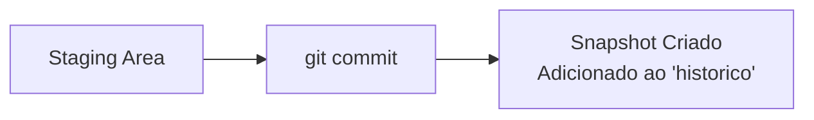
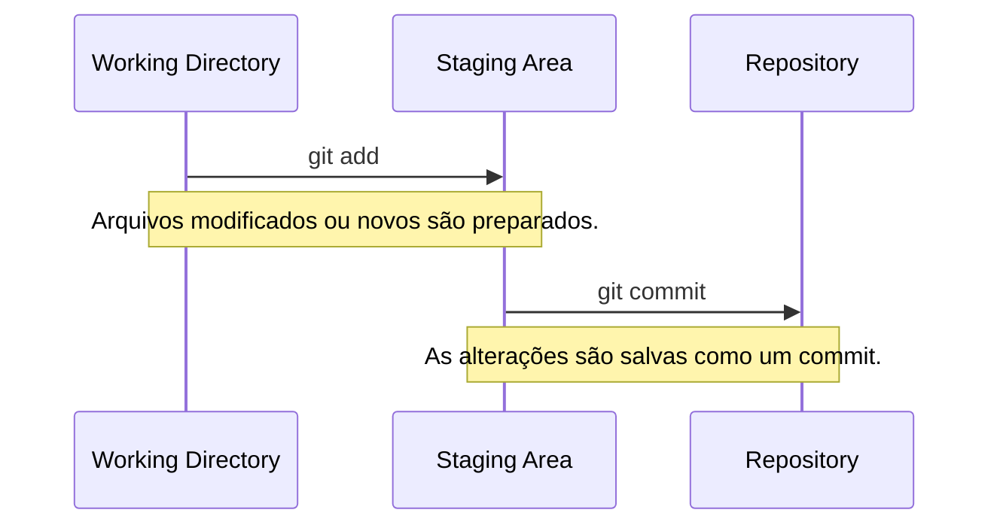

# Trabalho com Commits

## Adicionando arquivos

O comando `git add` é usado para adicionar arquivos à **staging area**, uma
área de preparação onde as mudanças são organizadas antes de serem
confirmadas em um commit.
Como usar:
- Para adicionar um arquivo específico:
  ```bash
  git add nome_do_arquivo.txt
  ```
- Para adicionar todos os arquivos modificados:
  ```bash
  git add .
  ```


---

## Criando commits

O comando `git commit` cria um **snapshot** (captura de estado) das mudanças
que estão na staging area. Cada commit deve ter uma mensagem descritiva para
documentar as alterações.

Como usar:
```bash
git commit -m "Mensagem descritiva do commit"
```

Dicas:
- Mensagens claras e objetivas ajudam a entender o histórico do projeto.
- Commits frequentes facilitam a identificação de problemas e a reversão de mudanças.



---

## Verificando o status

O comando `git status` mostra o estado atual do repositório, incluindo arquivos
modificados, adicionados ou que ainda não estão sendo rastreados pelo Git.

Como usar:
```bash
git status
```

- O que é informado:
    - Arquivos modificados que ainda não foram adicionados à staging area.
    - Arquivos prontos para commit (na staging area).
    - Arquivos não rastreados (novos arquivos).

## Visualizando o Fluxo (Working, Staging e Repository)


- Git trabalha com três áreas principais:
    1. Working Dir: Onde você faz alterações nos arquivos.
    2. Staging Area: você prepara as alterações para serem commitadas.
    3. Repository: Onde as alterações são salvas permanentemente como commits.



[Cap. Anterior](./basico.md) - [Próx. Capítulo](./historico.md)
