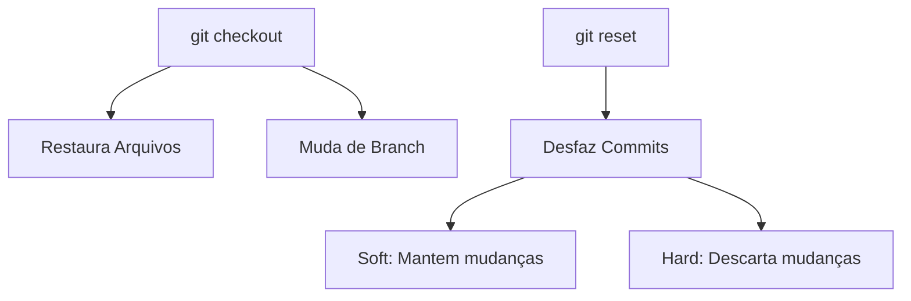

# Histórico e Logs

## Visualizando o histórico

O comando `git log` exibe o histórico de commits do repositório, mostrando
informações como autor, data, hash do commit e mensagem.

- Como usar:
    ```bash
    git log
    ```

- Opções úteis:
    - Exibir histórico resumido
        ```bash
        git log --oneline
        ```
    - Exibir gráfico de branches e merges
        ```bash
        git log --graph
        ```

----------

## Diferenças entre commits

O comando `git diff` mostra as diferenças entre arquivos ou commits. Ele é
útil para comparar mudanças antes de adicioná-las à staging area ou entre
dois commits.

Como usar:
- Comparar mudanças não adicionadas à staging area:
  ```bash
  git diff
  ```
- Comparar mudanças entre dois commits:
  ```bash
  git diff commit1 commit2
  ```

----------

## Desfazendo alterações

O comando `git checkout` permite restaurar arquivos para um estado anterior ou
mudar para uma branch diferente.

Como usar:
    - Restaurar um arquivo para o estado do último commit:
        ```bash
        git checkout -- nome_do_arquivo
        ```
    - Mudar para uma branch existente:
        ```bash
        git checkout nome_da_branch
        ```

----------

O comando `git reset` desfaz commits ou alterações no staging area, dependendo
do modo utilizado.

- Modos de uso:
    - Soft: Remove o commit, mas mantém as mudanças no staging area.
        ```bash
        git reset --soft HEAD~1
        ```
    - Hard: Remove o commit e descarta todas as mudanças.
        ```bash
        git reset --hard HEAD~1
        ```



[Cap. Anterior](./commits.md) - [Próx. Capítulo](./branches.md)
