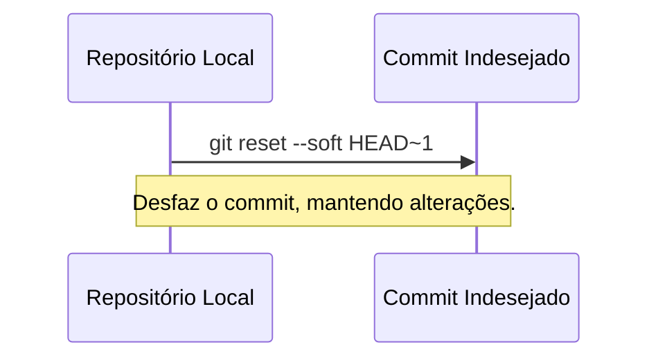
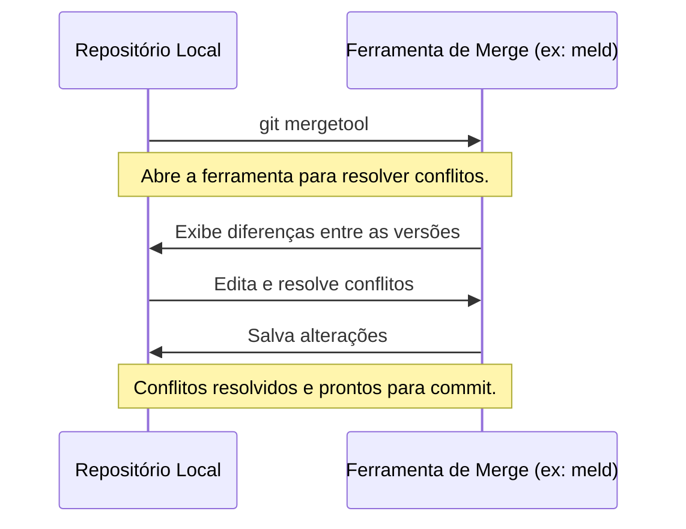

# Resolução de Problemas Comuns

Trabalhar com Git pode trazer alguns desafios, mas a maioria dos problemas tem
soluções simples.

----------

## Desfazendo commits indesejados

Às vezes, você pode cometer um erro e precisar desfazer um commit. O Git
oferece várias maneiras de fazer isso, dependendo da situação.

### Desfazendo o último commit (mantendo as alterações)

Se você deseja desfazer o último commit, mas manter as alterações no working directory:
```bash
git reset --soft HEAD~1
```

### Desfazendo o último commit (descartando as alterações)

Se você deseja desfazer o último commit e descartar todas as alterações:
```bash
git reset --hard HEAD~1
```

### Revertendo um commit específico

Se você já enviou o commit para o repositório remoto e precisa desfazê-lo sem alterar o histórico:
```bash
git revert <hash-do-commit>
```



----------

## Recuperando arquivos deletados

Se você acidentalmente deletou um arquivo, Git pode ajudá-lo a recuperá-lo.

### Recuperando um arquivo deletado

Se o arquivo foi commitado anteriormente, você pode restaurá-lo a partir do histórico:
```bash
git checkout <hash-do-commit> -- caminho/do/arquivo.txt
```

### Verificando arquivos deletados

Para listar todos os arquivos deletados no histórico:
```bash
git log --diff-filter=D --summary
```

----------

## Lidando com conflitos complexos

Conflitos de merge podem ser complicados, especialmente em projetos grandes.
Algumas dicas e ferramentas para ajudar a resolvê-los.

### Passos para resolver conflitos:

1. Identifique os arquivos com conflitos usando `git status`.
2. Abra os arquivos e procure por marcadores de conflito (`<<<<<<<`, `=======`, `>>>>>>>`).
3. Edite os arquivos para resolver as diferenças.
4. Adicione os arquivos resolvidos ao staging area:
   ```bash
   git add arquivo-conflitante.txt
   ```
5. Complete o merge:
   ```bash
   git commit
   ```

### Usando ferramentas de merge

Ferramentas como `meld` ou `kdiff3` podem ajudar a visualizar e resolver
conflitos de forma mais eficiente. Essas ferramentas fornecem uma interface
gráfica para comparar as diferenças entre as versões do código.

#### Configurando uma ferramenta de merge

Para configurar Git para usar uma ferramenta de merge, como o `meld`:
```bash
git config --global merge.tool meld
```

#### Abrindo a ferramenta de merge

Para resolver conflitos com a ferramenta configurada:
```bash
git mergetool
```



----------

[Cap. Anterior](./avancado.md)
