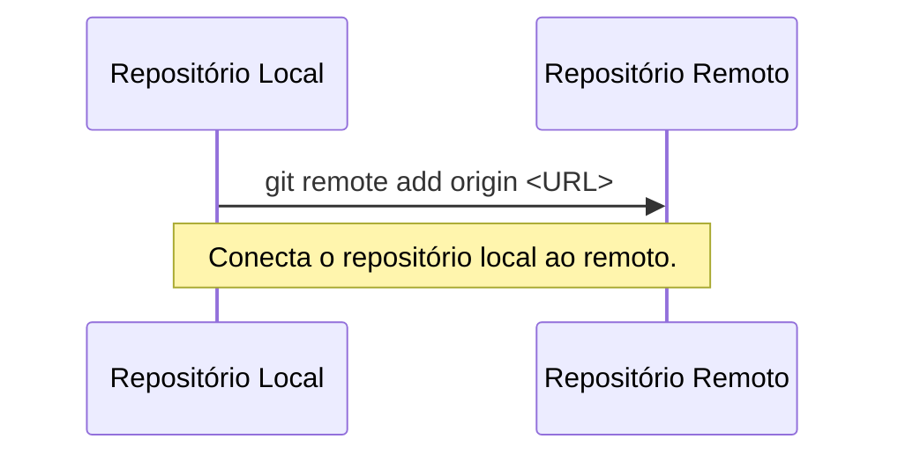
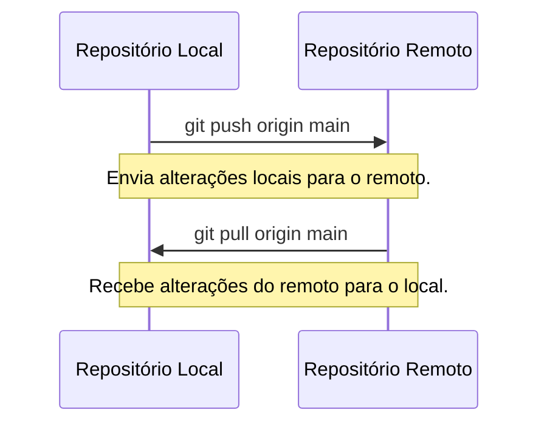
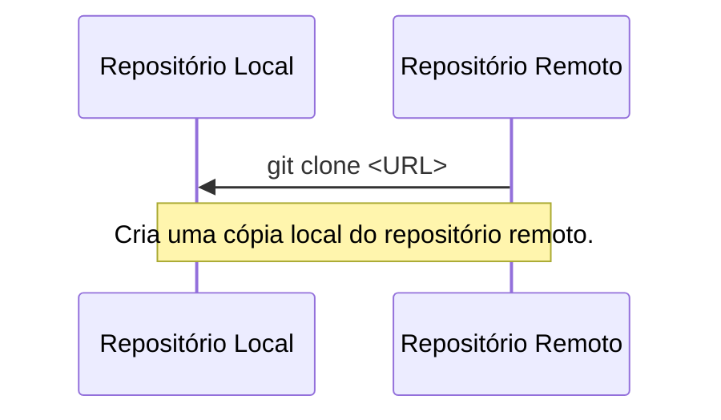
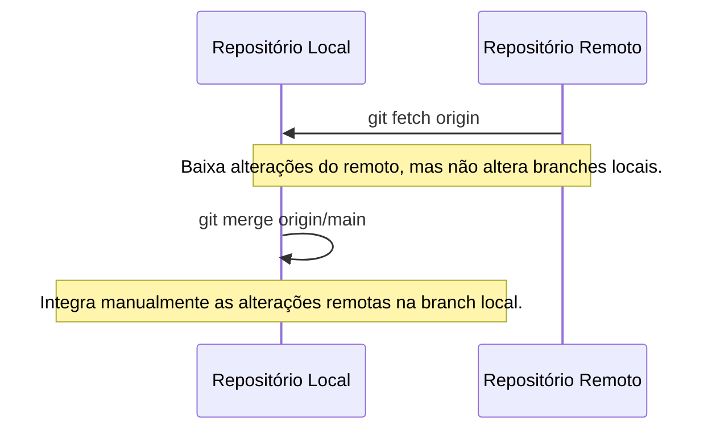

# Trabalhando com Repositórios Remotos

Repositórios remotos são versões do seu projeto hospedadas em servidores
externos, como GitHub ou GitLab.

----------

## Adicionando um repositório remoto

Para "conectar" seu repositório local a um repositório remoto, use o comando `git remote add`.

### Comando:
```bash
git remote add origin <URL-do-repositório>
```

> `origin` é o nome padrão para o repositório remoto, mas você pode usar outro nome.



----------

## Enviando e recebendo alterações

### Enviando alterações

`git push` envia as alterações do seu repositório local para o repositório remoto.

#### Comando:
```bash
git push origin main
```

- `origin` é o nome do repositório remoto.
- `main` é o nome da branch que você está enviando.

> É importante enviar branches separadamente para evitar conflitos.

### Recebendo alterações

`git pull` atualiza seu repositório local com as alterações do repositório remoto.

#### Comando:
```bash
git pull origin main
```

- `origin` é o nome do repositório remoto.
- `main` é o nome da branch que você está atualizando.



----------

## Clonando um repositório

Para trabalhar em um projeto existente, você pode clonar um
repositório remoto usando o comando `git clone`.

### Comando:
```bash
git clone <URL-do-repositório>
```

- Isso cria uma cópia local do repositório.



----------

## Usando `git fetch` para atualizar o histórico remoto

`git fetch` é usado para baixar as alterações do repositório
remoto para o seu repositório local, mas não faz o merge automático dessas
alterações nas suas branches locais.

### Comando:
```bash
git fetch origin
```

- `origin` é o nome do repositório remoto.

Após o `fetch`, você pode visualizar as alterações remotas usando:
```bash
git log origin/main
```

Para integrar as alterações remotas na sua branch local, você pode fazer o merge manualmente:
```bash
git merge origin/main
```

### Por que usar `fetch` em vez de `pull`?

- Com `fetch`, você pode revisar as alterações antes de integrá-las ao seu código.
- Evita merges automáticos que podem causar conflitos inesperados.
- Permite que você decida como e quando integrar as alterações.



----------

[Cap. Anterior](./branches.md) - [Próx. Capítulo](./tags.md)
