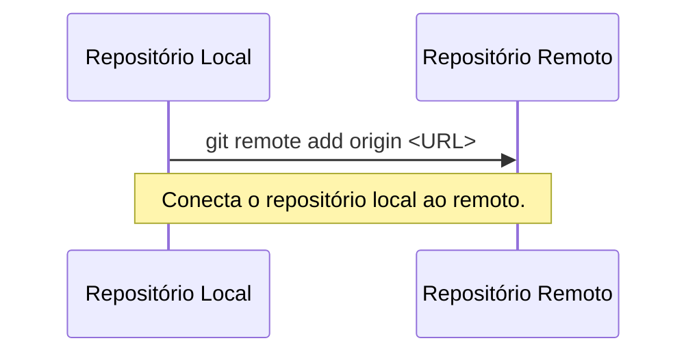
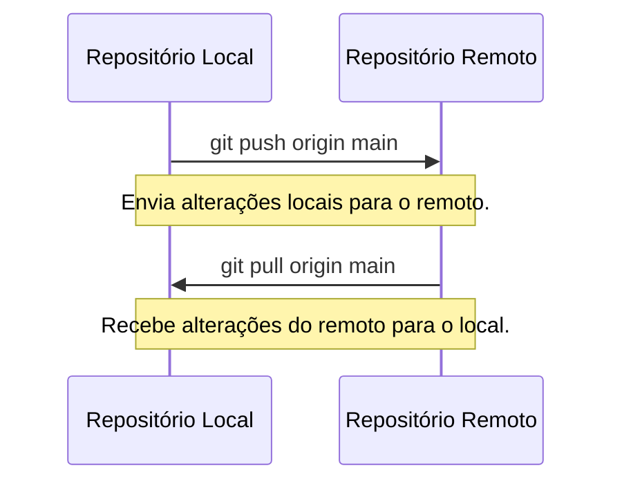
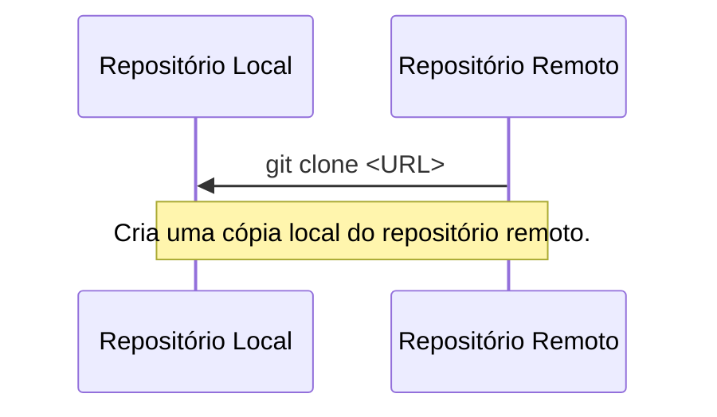

# Trabalhando com Repositórios Remotos

Repositórios remotos são versões do seu projeto hospedadas em servidores
externos, como GitHub ou GitLab.

----------

## Adicionando um repositório remoto

Para "conectar" seu repositório local a um repositório remoto, use o comando `git remote add`.

### Comando:
```bash
git remote add origin <URL-do-repositório>
```

> `origin` é o nome padrão para o repositório remoto, mas você pode usar outro nome.



----------

## Enviando e recebendo alterações

### Enviando alterações

`git push` envia as alterações do seu repositório local para o repositório remoto.

#### Comando:
```bash
git push origin main
```

- `origin` é o nome do repositório remoto.
- `main` é o nome da branch que você está enviando.

### Recebendo alterações

`git pull` atualiza seu repositório local com as alterações do repositório remoto.

#### Comando:
```bash
git pull origin main
```

- `origin` é o nome do repositório remoto.
- `main` é o nome da branch que você está atualizando.



----------

## Clonando um repositório

Para trabalhar em um projeto existente, você pode clonar um
repositório remoto usando o comando `git clone`.

### Comando:
```bash
git clone <URL-do-repositório>
```

- Isso cria uma cópia local do repositório.



----------

[Cap. Anterior](./branches.md) - [Próx. Capítulo](./tags.md)
