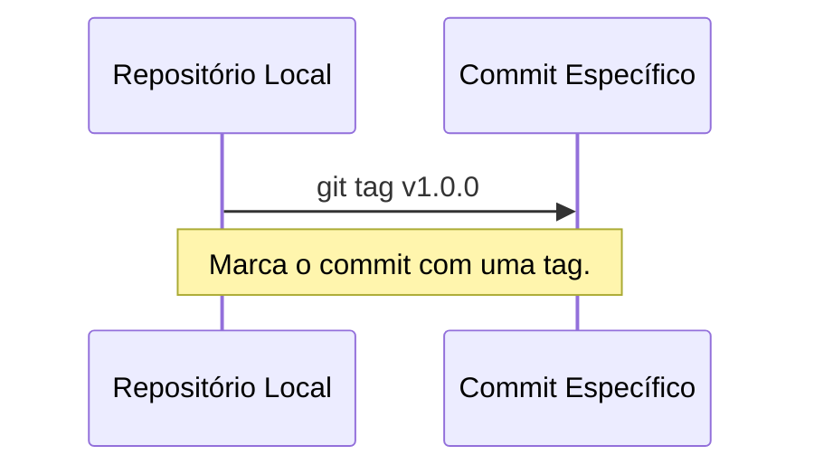
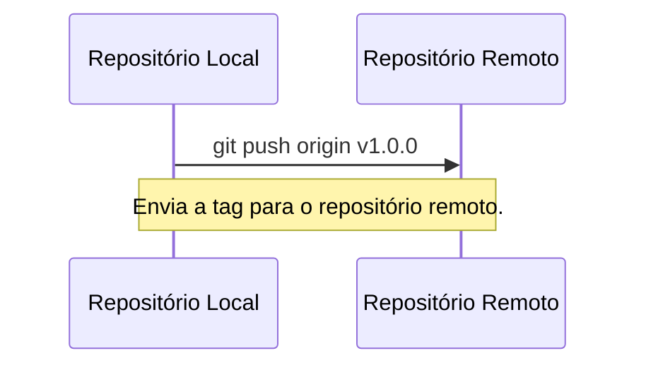

# Tags e Versões

Tags são usadas para marcar pontos específicos no histórico do seu projeto,
como versões estáveis ou releases. São úteis para referenciar versões
importantes do código.

----------

## Criando tags

`git tag` permite criar tags para marcar commits específicos.

### Criando uma tag leve
Uma tag leve é apenas um ponteiro para um commit específico.

#### Comando:
```bash
git tag v1.0.0
```

### Criando uma tag anotada

Uma tag anotada inclui metadados, como nome, e-mail, data e mensagem.

#### Comando:
```bash
git tag -a v1.0.0 -m "Versão 1.0.0 estável"
```

### Listando tags

Para ver todas as tags do repositório:
```bash
git tag
```



----------

### Enviando tags para o repositório remoto

```bash
git push origin v1.0.0
```

Para enviar todas as tags:
```bash
git push origin --tags
```

### Verificando uma tag

Para visualizar o conteúdo de uma tag, use o comando `git checkout`:
```bash
git checkout v1.0.0
```



[Cap. Anterior](./remotos.md) - [Próx. Capítulo](./boas-praticas.md)
